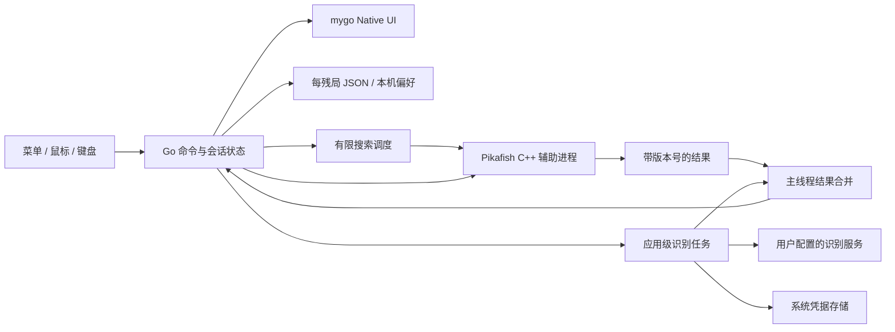
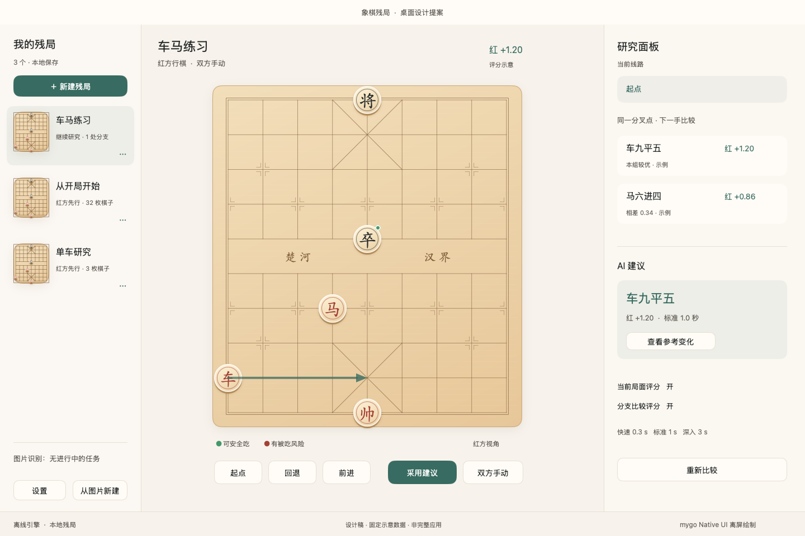
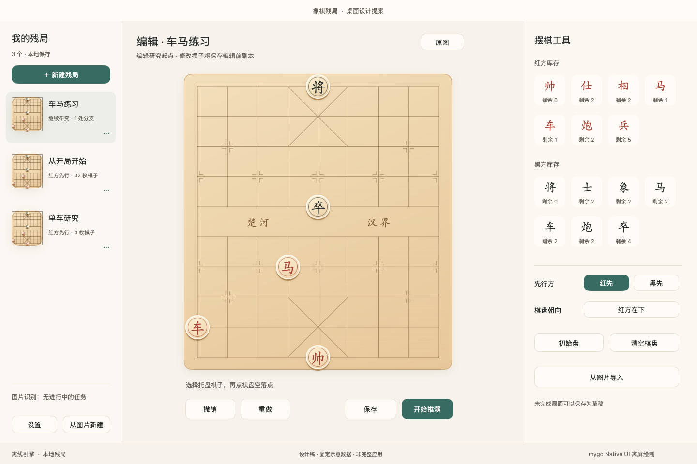

# 象棋残局桌面端：调研与设计方案

调研与自行复核日期：2026-10-07。目标：使用 **mygo 的 Go Native UI** 制作 macOS、Windows、Linux 桌面应用，完整保留原项目的功能与产品语义，重新组织桌面交互，并达到原规格要求的视觉与动画质量。

本方案区分四类信息：原项目已实现的行为、原规格要求、桌面端建议、仍需运行验证的能力。方案中的尺寸、动效和性能指标是实施目标；示意评分不是实测引擎结果。本轮没有请求任何收费图片识别服务。

本次在工作区已有设计文档与绘图探针上直接复核和修订，全部调研、源码检查和验证由当前助手完成。工作区已有部分 Go/C++ 实现，本报告不把这些文件的存在视为完整产品验收，也不修改其业务代码。

## 1. 推荐方案

采用 **三栏研究工作台 + 自绘浅木棋盘 + Go 业务状态 + Pikafish C++ 引擎辅助进程**。

- 左侧是残局库，中央是始终稳定的棋盘与导航操作，右侧按场景显示研究分析、摆棋工具或原图校正。
- 所有产品界面均由 `github.com/egoist/mygo/ui` 绘制，通过 `WindowOptions.Content: ui.View(...)` 挂载，不使用 WebView 作为棋盘或业务界面。
- 延续暖白、浅木、朱红、墨黑、青绿操作色；棋子、落点、上一手、将军、红绿灯与推荐箭头都独立绘制。
- 原版 Swift 业务逻辑移植到 Go；Pikafish 规则和安全吃子扩展保留 C++，通过本机进程协议调用。
- 每个残局继续保存为一个 JSON 文件，研究树、当前节点、朝向保持原语义；评分缓存和 AI 控制状态不写入残局。
- 三个平台同一套功能与视觉语言，窗口装饰、菜单、文件选择、凭据存储和安装包适配各自系统。

**mygo 适合这类软件，但“Native UI”在这里指 Go 编写的自绘桌面 UI，不代表所有按钮都是 AppKit、WinUI 或 GTK 原生控件。** 窗口、输入与系统接口有实际平台后端；控件、棋盘和大部分动画由 mygo 自己绘制。[界面入口与状态模型][m-views]、[平台渲染][m-render]

最需要优先解决的不是页面数量，而是：保留原规则扩展、正确拒绝迟到的 AI 结果、跨平台中文字体、棋盘拖拽与动画连续性，以及识别任务独立于页面的生命周期。

## 2. 调研基线与证据

### 2.1 固定版本

| 对象 | 本轮快照 | 用途 |
| --- | --- | --- |
| 原 App | `391fce78c4d2cd5cacc91ddcfe175d9776a27ce3` | 功能、设计规范、Swift 实现与验证记录 |
| mygo | `49b7a7fa599b689720b1fafcc3a5f4fea7fcb94c` | Native UI API、后端、绘制、输入、分发实现 |
| Pikafish | `Pikafish-2026-09-06`，`4c17cee11f888ae1d48a9494f2e2239f019f0a1f` | 与原 App 相同的规则和搜索版本 |
| NNUE | SHA-256 `7d13d73569a9b571ba0eb20cf1596247bc2a42738967e61afef6482b231e900e` | 与原 App 相同的离线模型 |

原项目已有 macOS 入口，但采用接近手机的窄内容区；它不是本次所需的完整桌面布局。原版包括残局库、编辑、推演、评分、分支比较和联网图片导入，不能按较早 README 中的基础残局功能估算范围。[产品规格][s-spec]、[App 入口][s-app]

### 2.2 本轮实际做过的验证

| 检查 | 结果 | 可以证明的范围 |
| --- | --- | --- |
| 原规格、Swift、C++ 桥接、资源准备脚本阅读 | 完成 | 已核对功能和关键规则来源 |
| 原版页面与评分预览视觉检查 | 完成 | 已观察配色、棋盘、棋子、状态、按钮和信息密度 |
| 当前助手直接源码复核 | 完成 | 自行检查原版业务语义与 mygo 实现边界；已取消的子代理任务不作为证据 |
| mygo Native 示例，`CGO_ENABLED=0` | macOS arm64、Windows amd64、Linux amd64 编译通过 | 当前源码在这些目标能编译；不代表安装或交互已验收 |
| Go 工具链 | 仓库内 `go version` 为 `go1.27.1` | 框架当前 `go.mod` 的要求可在本机满足 |
| Foundation 日期编码探针 | Unix 零时刻编码为 `-978307200` | 原版默认日期编码与 Go 默认 `time.Time` JSON 不兼容 |
| mygo `ui.Render` 离屏设计稿 | 研究、编辑两张 1440×960 PNG 生成 | Mac 上的中文、路径、渐变、阴影可离屏绘制；不代表 GPU 或手势验收 |

本轮没有实现业务模块，也未做 Windows/Linux 实机运行、工作区产品代码的完整验收、系统凭据接口验证、安装签名或图片识别调用。后文不会将这些写成已验证事实。

### 2.3 原规格与当前代码的差异

| 项目 | 规格或研究报告 | 当前代码 | 桌面方案决定 |
| --- | --- | --- | --- |
| 吃子反馈 | 要求吃子淡出 | 未见专门的吃子淡出 transition | 桌面补齐淡出，作为视觉验收项 |
| 移动动画 | 约 200 ms | `response: 0.26` 的弹簧；该参数不是精确总时长 | 采用约 200–260 ms 的可中断移动 |
| 选中棋子的灯 | 规格称只突出该子目标 | 绿灯按选中攻击者筛选，红灯仍全盘显示 | 保留实际灯语义；危险关系可通过悬停详情说明 |
| 推荐附评分 | 规格称始终附带评分 | 缺少有效评分时仍可能展示合法推荐，显示“暂无评分” | 同次结果有评分则显示；缺失时明确提示，不伪造数值 |
| 原图 | 对照原图校正 | 实际保留经方向校正、最长边 2048 的 JPEG | 延续这一处理图语义，预览中称“原图” |
| 识别恢复 | 任务和结果可以恢复 | 不恢复原编辑器未保存的摆棋 | 识别任务与编辑草稿分开，恢复入口不覆盖其他残局 |
| 开始下一次识别 | 应用级单任务 | 运行中禁止新任务；已完成任务会在新任务开始时被清理 | 桌面显示待导入结果的替换动作，明确这是交互改善；识别结果仍需主动导入 |

以上差异来自 [棋盘实现][s-board]、[编辑器][s-editor]、[研究状态][s-session]、[研究页面][s-studyview] 和 [图片导入说明][s-import]。功能复刻以当前实现的业务语义为准，视觉反馈同时补齐原规格明确要求的部分。

## 3. 功能一比一覆盖表

这里的“一比一”指功能结果、规则含义、数据保存与用户控制权一致；手机相册、震动和 iOS 系统后台传输在桌面有对应的平台适配。

### 3.1 残局库与编辑

| 编号 | 原功能与必须保留的行为 | 桌面入口与验收 |
| --- | --- | --- |
| F01 | 空盘新建；首次提供原版三个样例 | 左侧“新建残局”；首次初始化种子只执行一次 |
| F02 | 列表按修改时间排序，显示缩略图、草稿、当前手数与分叉点数量 | 常驻侧栏；草稿打开编辑器，有效残局打开研究 |
| F03 | 最近有推演的残局提示“继续研究” | 保留标记；重开恢复当前节点和棋盘朝向 |
| F04 | 改名、编辑棋子与名称、复制、删除 | 行尾菜单和右键菜单；删除明确包含整棵研究树 |
| F05 | 红黑双方全部七类棋子与剩余库存 | 编辑右栏同时显示两组；每方将帅 1、兵卒 5、其他各 2 |
| F06 | 托盘点选后点空交叉点放置 | 支持原交互；增加从托盘拖到棋盘的桌面等价入口 |
| F07 | 已有棋子选中、移到空位、拖动调整 | 编辑不执行吃子；拖到占位点拒绝，不覆盖 |
| F08 | 删除选中棋子后退出选择，无连续删除模式 | 右键删除、按钮与 Delete；仅编辑器选中棋子时生效 |
| F09 | 放置、移动、删除、清空、初始盘、图片替换可撤销/重做 | `Cmd/Ctrl+Z` 与重做；保持原版棋子数组历史范围 |
| F10 | 先行方与棋盘朝向独立 | 右侧独立控件；翻转不改变先行方 |
| F11 | 未完成或非法局面可以保存为草稿 | 保存允许；开始推演须通过 Pikafish 校验并给具体原因 |
| F12 | 编辑已保存残局编辑的是研究起点 | 仅改名/朝向保留分支；修改棋子/先行方重置起点 |
| F13 | 已有研究被修改前保留“编辑前”完整副本 | 先成功保存副本，再覆盖原残局；取消编辑不改原文档 |

原版编辑撤销不包含名称、先行方或朝向；“草稿”表示保存的局面尚未通过规则校验，不能把它等同于“尚未保存”。[领域模型][s-domain]、[编辑实现][s-editor]、[保存实现][s-store]

### 3.2 研究、规则与 AI

| 编号 | 原功能与必须保留的行为 | 桌面入口与验收 |
| --- | --- | --- |
| F14 | 默认双方手动，当前方只能走合法着 | 点击/拖动共用规则结果；合法落点提示 |
| F15 | 起点、回退、前进、当前线路跳转 | 中央底部常驻按钮；键盘与右侧线路同步 |
| F16 | 回退改走新增分支；同一父节点重复同一着复用已有子节点 | 两条线路均可继续；分支保持创建顺序 |
| F17 | 前进沿本次研究已选线路；未选的多分支点先选分支 | 会话内保存偏好子节点，不擅自进入第一条 |
| F18 | 离线 AI 推荐与“采用”分离 | 搜索只显示箭头、中文着法、评分及变化；采用才落子 |
| F19 | AI 思考可停止，旧结果不能应用到变化后的局面 | 停止、回退、切分支、换局、离页都使请求失效 |
| F20 | 双方手动 / 我红 AI 黑 / 我黑 AI 红 | 原三模式；回退或切分支暂停，用户恢复；重启默认双方手动 |
| F21 | 快速、标准、深入有限搜索 | 沿用 0.3 / 1 / 3 秒预算与一条 PV；首版不换成持续分析 |
| F22 | 当前评分与分支评分独立开关，默认开，本机保存 | 右侧两个独立开关；两者关仍能主动请求带评分建议 |
| F23 | 普通分固定红方视角，支持上下界、M、≈M、终局 | 翻转、轮次、AI 控制者改变均不改变分数视角 |
| F24 | 分支比较评估同一分叉点各下一手后的局面 | 不比较不同长度已保存线路的末端；不扫描整棵树 |
| F25 | 同预算全部普通精确评分才标“本组较优”和差值 | 红取较高分，黑取较低红方分；M、界限、失败不参与差值 |
| F26 | 当前局面优先，展开的分支逐个分析；主动 AI 抢占 | 未展开不分析分支；收起取消余下任务；失败显式重试 |
| F27 | 合法着、将军、将死、困毙、规则判胜/和棋 | 使用原 Pikafish 规则与完整路径历史；终局禁止继续落子 |
| F28 | 安全吃子红绿灯，观察方是棋盘底部一方 | 合法吃子后无立即合法回吃；非多步战术安全承诺 |
| F29 | 上一手、选中棋子、合法落点、将军环、推荐箭头 | 各层均保留；关闭灯同时移除图例所占空间 |

特别注意：原版“分支数”是发生分叉的节点数；前进线路偏好和 AI 托管不是残局 JSON 的持久字段。评分查看和参考变化不落子、不新增研究节点。[研究状态][s-session]、[评分转换][s-engine]、[规则桥接][s-bridge]

### 3.3 图片识别、设置与反馈

| 编号 | 原功能与必须保留的行为 | 桌面入口与验收 |
| --- | --- | --- |
| F30 | 单张图片选择、预览、放大、显式开始识别 | 系统文件选择；补充文件拖入入口；选图不自动上传 |
| F31 | DeepSeek 官方固定模型；自定义两种接口 | 保留 DeepSeek / 自定义两类，以及 Chat Completions / Responses |
| F32 | 基础或标准完整地址、模型、可选 Bearer 密钥、HTTP 局域网 | 地址只拼标准接口后缀，不自动补 `/v1`；切 API 替换后缀 |
| F33 | 官方四档思考、默认高；自定义另有服务默认 | 自定义默认不传 reasoning 和输出预算；手动时按原请求映射 |
| F34 | 两类服务密钥独立；保存设置才提交，取消不改 | 系统凭据库；移除密钥也是暂存编辑，保存才生效 |
| F35 | 识别成功、失败、停止、离页继续、恢复入口 | 应用级单任务；迟到结果无效；不自动重复付费调用 |
| F36 | 识别结果先“导入并校正”，不直接保存或覆盖研究 | 校验位置/数量/重叠，按图片朝向换算；未知先行方红先 |
| F37 | 校正时保留原图，保存或取消后释放 | 右栏原图或独立查看窗口；图片不进入残局 JSON |
| F38 | 选择、移动、吃子、非法与将军反馈 | 完整视觉动效；桌面触感按硬件能力适配，声音可独立关闭 |

原项目自定义服务只有一套配置，不是多个服务档案管理器；不存在独立 Luna 入口。DeepSeek 的 `deepseek-v4-flash` 是原项目固定配置，本轮未验证该服务实时可用性。[识别配置][s-rec-settings]、[请求实现][s-rec-request]、[图像与官方请求][s-deepseek]

### 3.4 桌面首版范围

本次允许的桌面适配包括：并排面板、系统菜单、快捷键、文件拖入、鼠标悬停说明、窗口和分栏尺寸记忆、原图并排查看。这些不改变棋类业务规则。

在线对战、登录云同步、标签收藏、批注、全树图形导航、XQF/CBR 导入导出、多主题与复杂规则变体不是当前已实现功能，也不作为复刻前置任务。原版明确暂缓格式导入导出；“读取同格式 JSON”与“新增跨设备导入界面”应区分。[原规格范围][s-spec]

## 4. 桌面信息架构与页面设计

### 4.1 主窗口

设计稿的画布为 **1440×960 DIP**；它是宽屏展示规格。主窗口首次打开取目标屏幕 `WorkArea` 内可用大小，建议目标 **1280×800 DIP**。macOS 实现采用 `TitleBarHiddenInset`，按用户提供的展开/收起侧栏截图采用分区顶栏：浅灰残局库从窗口顶端贯通到底部，系统红黄绿和收起按钮位于侧栏顶部；主区域以与正文连续的背景承载当前残局名和新建、设置、分析面板三个线框图标。顶部高度约 56 DIP，侧栏分割线延伸至窗口顶部，无横贯窗口的顶栏分隔线。收起侧栏时，打开按钮和残局名称移动到系统按钮右侧。通过 `c.TitleBar()` 动态避让窗口按钮，空白处可拖动窗口；全屏时取消红黄绿的预留空间。屏幕顶部的应用菜单仍使用系统菜单栏。内容区最小目标约 **960×640 DIP**。在 1366×768 屏幕上按实际工作区收缩，不能硬设 960 DIP 高的窗口。优先适配 1366×768 笔记本与 1440×900、1920×1080 显示器；尺寸全部按逻辑像素计算。[屏幕工作区 API][m-desktop]

```text
┌── 红黄绿 / 收起 ┬ 当前残局名称              新建 设置 分析 ┐
│ 残局库 252     │ 行棋方、终局状态、当前评分 │ 场景面板 360  │
│ 新建 / 图片    │                            │ 当前线路     │
│                │       浅木棋盘             │ 分支比较     │
│ 缩略图列表     │                            │ AI 建议      │
│ 改名 / 编辑…   │                            │ 或摆棋托盘   │
│                │ 图例与观察方                │ 或原图校正   │
│ 识别状态       │ 起点 回退 前进 AI 模式      │ 常态设置     │
│ 本地保存       │ 保存状态 / 单次操作状态                   │
└──────────────────────────────────────────────────────────┘
```

推荐默认左栏 252、右栏 360 DIP，可调整；左栏业务下限约 220，右栏下限约 300。mygo `Split` 自带的最小值不足以保证棋盘可用，应用需自己约束并决定折叠。各区用局部滚动，棋盘与主要导航不随分析内容滚动。[分栏 API][m-split]

| 可用宽度 | 布局策略 |
| --- | --- |
| ≥1280 | 完整三栏；棋盘由中央宽度和可用高度共同决定大小 |
| 1100–1279 | 左栏折叠，中央棋盘 + 右侧分析；残局库通过按钮临时展开 |
| 960–1099 | 左栏隐藏；研究/工具右栏可收起，需要时显示；主操作始终可达 |

布局不能只按宽度分档：低高度屏幕先压缩标题和辅助间距、将低频设置收进菜单，再调整棋盘。窗口缩放时不触发布局弹簧；显示分析建议不能挤压或重新放大棋盘。

低高度布局保留约 48 DIP 的局面标题、24 DIP 的图例、44 DIP 的主操作和紧凑保存状态。640 DIP 内容高度时，棋盘目标约 420×467 DIP，研究面板与编辑托盘各自滚动。系统文字放大后以内容最小尺寸触发折叠，不按物理分辨率强行维持三栏；外接屏断开时重新将窗口限制到当前工作区。

### 4.2 残局库

每行约 96–112 DIP，缩略图约 64×72，名称 15–16 DIP，辅助信息 12–13 DIP。使用当前局面生成缩略图，草稿用初始摆子。点击选中并显示研究，草稿进入编辑；双击可作为相同打开行为，不创造第二种研究语义。

行尾菜单常驻且可键盘打开；右键提供同样四个原版动作。删除用系统确认框；文件保存失败与规则校验提示分开。空库显示“新建残局”和“从图片新建”；全应用识别任务的状态入口持续可见。

首版沿用原排序，不新增筛选分类体系。列表数据多时使用 `ui.List`；缩略图按残局修改版本缓存，不在每帧重算规则或引擎评分。[库实现][s-library]、[mygo 列表][m-list]

### 4.3 研究工作台

残局名显示在主区域顶栏；棋盘上方仅显示当前行棋方、将军/终局状态与紧凑当前评分，不重复名称。评分点击打开深度、预算、视角与上下界详情。两个概念同时存在：**评分始终看红方，红绿灯看底部一方**，通过明确短标签区分。

棋盘底部固定：起点、回退、前进或选分支、AI 建议/停止/采用、控制模式。AI 结果放右侧固定区，空闲、思考、建议、托管暂停、失败占用相近空间。有效建议出现后主动作变为“采用”；棋盘仍保持原大小。

右侧依次展示当前线路、当前分叉点比较、AI 建议及参考变化入口、研究开关。线路采用紧凑着法行，当前节点清楚高亮；有分叉的节点显示分支标记。桌面可以用缩进表达已存线路，但首版主入口仍是当前线路与同层比较，不引入全树画布。

展开比较区域是一个明确行为：只有这时创建分支分析任务，正在托管则暂停。评分完成不重排分支；收起取消未完成的分支分析。不要因为右栏始终存在而让所有分支自动扫描。

参考变化用只读列表/弹层，用户可以查看中文着法及局面预览；预览状态与主研究节点分开。关闭后回到原节点，不自动采用整条 PV。

### 4.4 摆棋编辑器

中央沿用同一棋盘，右侧放红黑两组七类托盘，推荐每方两行网格，在窄右栏中也保持数量可读。每个托盘项约 56–64 DIP，显示棋子与剩余数。

先行方、朝向、撤销/重做、初始盘、清空、图片入口、保存和开始推演都明确可达。Delete 只删除编辑器选中的棋子；研究页 Delete 不删除研究节点。点击棋子再点空位的原操作保留，同时支持拖拽；编辑占位冲突用原地提示和回弹说明，不自动吃子。

保存允许草稿；开始推演在底部动作附近显示具体错误，如缺少将帅、将帅照面、棋子区域不合法。编辑已有研究时显示“编辑研究起点”，修改棋子/先行方时说明会保留编辑前副本，避免误以为在编辑当前分支节点。

### 4.5 图片识别与校正

图片流程可以用独立面板或子窗口，保持四种主要状态：选图、识别中、失败、待校正。识别中不显示虚假的百分比；非流式请求无法可靠估计完成比例，使用旋转状态与已等待时间。

```text
选图 → 预览 → 点击识别 → 识别中 → 完成 → 导入并校正 → 编辑器 → 保存/推演
                         ├ 停止 → 清理任务
                         └ 失败 → 用户修改设置或显式重试
```

校正时可将原图与可编辑棋盘并排；原图用滚轮缩放、拖动平移、双击适配。原图入口始终可见，图片外的 UI 不参与落点命中。设置保存、切换页面、任务完成都不自动把新结果导入正在研究的其他残局。

| 状态 | 主要呈现 | 可用操作 |
| --- | --- | --- |
| 未选图 / 未配置 | 文件拖放区；服务配置提示 | 选择图片、打开设置；尚未上传 |
| 已选图 | 大图预览；当前服务与模型摘要 | 换图、放大、识别棋盘 |
| 识别中 | 保持图片；状态和已等待时间 | 停止、离开面板；恢复入口常驻残局库 |
| 识别失败 | 可操作的错误原因；保留处理图片 | 修改设置、显式重试、换图 |
| 完成待校正 | 棋子数量、朝向、先行方与识别备注 | 导入并校正、放大原图、丢弃 |
| 编辑校正 | 同时看到棋盘、托盘和原图入口 | 摆子、撤销、选择先行方、保存或推演 |

宽度足够时原图以可调的对照区显示；小窗口用原图查看子窗口。图片不会替代摆棋托盘的入口。第一次打开原图适配显示全部棋盘，缩放以鼠标位置为锚点；重新适配和缩放百分比有可见按钮。

识别任务全应用同一时间一个。第二次启动识别时必须明确处理已有运行中或待导入任务，避免无提示丢弃结果；不建设多任务队列。

### 4.6 设置窗口

采用一层设置导航：研究显示、图片识别、关于与资源说明。研究中常用的评分开关、红绿灯、预算和 AI 模式仍就近提供，避免必须进入设置窗口才能使用。

图片识别设置保留原字段与“高级设置”：服务、接口、地址、模型、密钥、思考强度、最终请求地址。字段变化只写临时设置对象，点击保存才写配置和凭据；取消不删除旧密钥。

### 4.7 快捷键与焦点

| 操作 | 建议快捷键 | 约束 |
| --- | --- | --- |
| 新建残局 | Cmd/Ctrl+N | 未保存编辑有明确处理入口 |
| 保存 | Cmd/Ctrl+S | 成功后才显示已保存 |
| 设置 | Cmd/Ctrl+, | macOS 应用菜单同步提供 |
| 编辑撤销/重做 | Cmd/Ctrl+Z；Cmd/Ctrl+Shift+Z | 文本输入有焦点时优先执行文本编辑 |
| 研究回退/前进 | Alt+← / Alt+→ | 不占用名称输入的编辑键，也避开棋位导航方向键 |
| 起点 | Cmd/Ctrl+Home | 只在研究上下文生效 |
| 翻转棋盘 | Cmd/Ctrl+Shift+F | 只改变显示朝向与灯观察方 |
| AI 建议 | Cmd/Ctrl+J | 无有效局面或终局时禁用 |
| 停止 / 取消选择 / 关弹层 | Esc | 优先处理最上层模态和拖拽，未处理才停止搜索 |
| 删除选中棋子 | Delete/Backspace | 仅编辑棋盘有焦点时；文本输入保持自身语义 |

快捷键走统一 Command 分发，菜单、按钮、键盘共用动作及启用条件。使用窗口内快捷键即可，不申请系统全局快捷键。Tab 按库 → 棋盘 → 主操作 → 侧栏移动；棋盘方向键移动焦点棋位，Enter 选择/落子。基础键盘能力随自绘棋盘一起实现，不建设完整读屏测试矩阵。[输入与焦点][m-input]

## 5. 视觉规范

### 5.1 设计语言与颜色

延续“安静的浅木棋桌”，桌面通过清晰分区与更充足的棋盘空间提高信息密度。背景保持平整，主要装饰集中在棋盘和棋子；操作以青绿为主，朱红用于红子、危险和重要棋类状态。

| Token | 值 | 来源/用途 |
| --- | --- | --- |
| Paper | `#F7F3EC` | 原版暖白背景 |
| Card | `#FFFCF7` | 原版面板和按钮底色 |
| Ink | `#292D2C` | 正文、黑方棋子 |
| Muted | `#68635D` | 次要说明，保持可读对比 |
| Red | `#A64035` | 红子、危险、将军 |
| Teal | `#386B61` | 主操作、推荐箭头、选中态 |
| Green | `#429969` | 安全吃子标记 |
| Line | `#E7DFD2` | 面板与控件边界 |
| Wood | `#E9CE9F` | 木质基色 |
| BoardInk | `#7C5B37` | 棋盘线、河界文字 |

以上来自原版 [Theme.swift][s-theme]。棋盘渐变继续参考 `#F2DEBA → #E9CE9F → #E7C799`；棋子用奶油色到浅木色的渐变、侧边厚度、内圈与克制投影，避免扁平文字圆片取代原视觉。

第一版只精修这套浅色主题；原版自身强制浅色，暗色主题不是复刻缺项。高对比度/减少动态效果按系统偏好调整关键状态，而不是重新设计一套皮肤。

### 5.2 字体、尺寸与图标

正文用各系统默认 UI 字体，主文字约 14–16 DIP，辅助 12–13，标题 20–24；长名称截断并在悬停或详情中显示全文。分数和深度用等宽数字以减少布局跳动。

应用自定义主题显式适配 `c.Preferences().TextScale` 和 `HighContrast`；直接设置固定字体尺寸与颜色后，不能假定仍自动继承默认主题的文字放大与对比度调整。棋子字面随棋子直径缩放，状态文案随系统文字设置缩放，两者分别处理。[系统偏好][m-preferences]

棋子与河界保留楷体观感。开发设计稿使用本机 `STKaiti`；发布版建议通过 `ui.RegisterFont` 打包一份未修改的 **霞鹜文楷 Regular**，保留其 OFL 和版权文件，避免 Windows/Linux 缺少楷体时回退到不同风格。发布前再比较其在圆形棋子中的字面大小与基线；首版不为压缩包体做字体子集改造。[字体来源][font-source]、[字体许可][font-license]、[mygo 字体入口][m-font]

统一使用可打包的 SVG 图标资源；不能直接依赖 SF Symbols 在其他平台存在。工具图标约 18–20 DIP，桌面鼠标控件高度约 32–40；触摸/粗指针目标扩大到约 44。侧栏、按钮和卡片圆角建议分别 0/8–10/12–16，减少手机式大圆角卡片的重复堆叠。

### 5.3 棋盘几何与绘制顺序

内部坐标沿用 `file: 0..8`、`rank: 0..9`，`rank=0` 永远是红方底线。显示红方在下时 `displayRow=9-rank`；黑方在下时 `displayFile=8-file`、`displayRow=rank`。命中判断使用同一映射的逆变换，缩放和翻转不修改数据。[原几何实现][s-board]

网格是 **9 列 10 行交叉点**，不是 9×10 的格子。格距 `u=min((W-2p)/8,(H-2p)/9)`，居中留白；棋子直径约 `0.81u`，保留原视觉比例。整个盘面约 0.9 的宽高比；给边缘棋子留足半径，避免边线位置的棋子被裁切。

边距 `p` 随棋盘缩放，至少容纳半枚棋子、选中环和投影。建议以 `u=min(W/9.1,H/10.1)` 留出约 `0.55u` 的每边空间，再居中放置交叉点；不要在大棋盘中仍固定沿用 26 DIP 边距。命中区域覆盖 90 个交叉点，装饰、箭头和拖动棋子不拦截下层棋位。

绘制顺序：木板底与纹理 → 棋盘线/九宫/炮兵标记/河界 → 上一手和合法空落点 → 棋子 → 选择/将军/灯 → 推荐箭头 → 拖动棋子 → 键盘焦点。

原项目将推荐箭头绘于较高层；桌面可对箭头穿过棋子部分降低透明度，避免挡住字。拖动棋子始终最上层。红/绿状态同时有图例及语义说明，将军使用独立环和文字，不仅依赖颜色。

## 6. 动画与反馈规范

| 场景 | 桌面目标 | 实现要点 |
| --- | --- | --- |
| 悬停/按下 | 80–120 ms 的轻颜色反馈 | 原按钮尺寸不变 |
| 选中棋子 | 约 120 ms，放大到约 1.055，阴影略加强 | 接近原版；不改变布局占位 |
| 拖动 | 棋子直接跟随指针 | 不在拖动跟随上叠加弹簧；7 DIP 左右区分拖拽与点击 |
| 合法移动 | 200–260 ms，轻缓出或阻尼弹簧 | 以稳定棋子 ID 插值显示坐标，可中断 |
| 吃子 | 被吃棋子 120–160 ms 淡出；落子照常移动 | 暂存退出棋子，不能直接删掉绘制状态 |
| 非法落点 | 约 140 ms 回原位并显示原因 | 不提交着法、不改变库存，不晃动整盘 |
| 将军 | 一次短红环强调，然后保持静态环/文字 | 不循环闪烁 |
| AI 箭头 | 120–160 ms 显示 | 当前有效建议才显示；失效立即撤销 |
| 分支跳转 | 约 160 ms 过渡 | 多步跳转不播放所有历史落子；棋子 ID 尽量保持 |
| 翻转 | 180–220 ms 坐标重映射 | 文字保持正向，不旋转整个窗口或 UI 子树 |
| 侧栏展开/收起 | 180–220 ms | 棋盘尺寸变化适度；缩放窗口时直接布局 |
| 减少动态效果 | 移动与布局立即到位，保留静态提示 | 自定义动画也读取系统 `ReduceMotion` |

**逻辑局面与动画展示状态分离。** 规则判定、保存和 AI 任务针对已经提交的逻辑局面；绘制使用动画坐标。连续回退或拖动打断动画时，从当前显示位置续接，不能回到旧起点重播。不要依赖动画结束回调决定是否保存或落子。

mygo 没有可假定的通用 Canvas 变换矩阵；棋子缩放应重新计算绘制直径与文字尺寸，翻转计算坐标。`Element.Rotate` 的当前实现针对图标，不能用它保证文字和整盘任意旋转。[绘图 API][m-drawing]、[SVG 实现][m-svg]

原版触感只在 iPhone 实现，原 Mac 入口没有震动。桌面必须保留选择、落子、吃子、非法和将军的视觉反馈；可提供独立的声音开关。Force Touch 等原生触感适配须先确认硬件与系统接口，mygo 当前没有通用触觉 API，不能承诺普通 Windows/Linux 鼠标产生震动。[原触感实现][s-feedback]

## 7. mygo 能力映射与边界

| 产品需要 | 当前接口/源码 | 判断与设计约束 |
| --- | --- | --- |
| 完全 Go Native UI | `ui.View`、`WindowOptions.Content` | 已有三平台后端；无需前端 IPC |
| 桌面布局 | Row/Column/Grid、`Split`、`SplitVertical` | 可用；业务自行处理最小尺寸和折叠 |
| 自绘棋盘 | `Box.Draw/DrawOver`、`Painter`、`Path` | 支持路径、渐变、文字、图片与裁剪 |
| 九宫斜线、箭头 | `StrokePath`、`FillPath` | `Painter.Line` 仅横竖线，斜线必须用 Path |
| 圆形棋子投影 | 圆角矩形 Shadow，半径为半径值 | 可做圆形外阴影；非任意路径/文字投影 |
| 中文棋子与正文 | `RegisterFont`、`RichText`、`Shape/Glyphs` | 平台字体塑形不同，需视觉探针；字形可缓存 |
| 点击、拖动、右键、文件拖入 | pointer 状态、`HandleInput`、Drag/Drop、DroppedFiles | 必须验证离盘释放、失焦、Esc、DPI 转换与点击抑制 |
| 过渡和自定义动画 | `AnimateWith`、Transition、`p.Now/AnimationFrame` | 按需帧；手写动画自己处理 ReduceMotion |
| 异步引擎/网络 | 后台 goroutine + `win.Update` | Update 回调不自动拒绝已关窗口的业务结果 |
| 大残局库、线路 | `List`、`Outline` | 只构建可见行；虚拟列表行本身不支持进出/重排 Transition |
| 原图查看 | Bitmap、Clip、自定义命中与图片目标 Rect | 平移/缩放需应用实现，不假定有现成手势图库 |
| 名称、模型、地址输入 | TextInput、系统 IME | 真实中文 IME/组合状态需实机测试 |
| 读屏与焦点 | Role、Label、Announce、FocusGroup | 自绘棋子不会自动得到可访问语义 |
| 系统菜单/文件选择 | `mygo.NewMenu`、`Dialog.Open/Message` | Dialog 阻塞，后台调用后通过 Update 提交结果 |
| 安装资源/辅助程序 | `PathResources`、平台资源目录、mygo build | 框架已考虑按平台打包 helper；不等于会编译 C++ |

依据：[绘图][m-drawing]、[输入][m-input]、[过渡][m-transition]、[窗口状态更新][m-content]、[虚拟列表][m-list]、[无障碍][m-access]、[分发][m-dist]。

### 7.1 平台矩阵

| 平台 | 已有后端 | 首批目标 | 待验收 |
| --- | --- | --- | --- |
| macOS | AppKit、CoreText、Metal/CPU | Apple Silicon；Intel 同批构建或随后验收 | DPI、拖拽、IME、睡眠、子进程签名 |
| Windows | Win32、DirectWrite、D3D11，设备失败可尝试 WARP | Windows 10/11 amd64；arm64 构建纳入后续实际设备验收 | 混合 DPI、中文 IME、无控制台 helper、安装 |
| Linux | GTK3、Pango、CPU/按需 GtkGLArea OpenGL | amd64，GTK3 桌面；X11/Wayland 各一条关键路径 | 依赖、文件拖入、输入法、Secret Service、显示缩放 |

桌面系统支持范围是产品目标，不能仅凭后端存在就承诺所有发行版、显卡和 CPU。mygo Windows/Linux 源码包含 amd64/arm64 实现，arm64 未在本轮运行验证；使用兼容 CPU 的引擎构建，不能把 AVX2 专用包当所有 x86-64 机器的默认包。[渲染文档][m-render]

### 7.2 Linux 分发的具体差异

纯 Native UI 的运行路径可以不加载 WebKitGTK，但当前 `cmd/mygo/deb.go` 无条件写入 `libwebkit2gtk-4.1-0` 依赖，安装脚本也有 WebKit 检测。本轮已从代码确认这一点。[Deb 源码][m-deb]、[安装脚本][m-install]

首版打包时选择以下具体处理：在锁定版本的构建脚本中对纯 Native UI 产物修正 Debian 依赖与安装检测，仅保留实际 GTK/Pango 等运行依赖；随后在没有 WebKitGTK 的 Linux 环境启动验证。也可保留上游额外依赖交付初次预览，但应明确这不是 Native UI 本身的运行要求。不要为了消除包装问题改成 WebView 棋盘。

## 8. 工程架构与规则复用

### 8.1 推荐结构



建议目录：

```text
cmd/xiangqi/              Go 桌面入口
internal/domain/         Study、Node、Piece、坐标与中文着法
internal/session/        编辑/研究动作、分支偏好、取消代次
internal/store/          原 JSON 兼容、原子保存、本机设置
internal/engine/         辅助进程协议、搜索调度、评分转换
internal/recognition/    请求构造、单任务、解析、临时目录
internal/credentials/    按平台接入凭据库
internal/ui/             工作台、库、编辑、研究、图片与设置
internal/ui/board/       几何、命中、绘制与动画展示状态
engine-worker/           Pikafish C++ 与原规则扩展
resources/               图标、字体、许可、NNUE
resources/<os>-<arch>/   对应架构引擎程序
```

这是建议结构，不要求先建通用框架。原规格强调尽快完成可运行闭环；首版保持单主窗口、单研究会话和一个搜索引擎，避免预先实现多窗口分析池或插件系统。[原项目约定][s-agents]

### 8.2 为什么不能只接标准 UCI

原桥接不仅调用搜索，还读取合法着、`Position::rule_judge`、将军、终局、胜方和双方向安全吃子。安全吃子由原项目自己的 `Position::safe_captures` 扩展实现，并通过 `chase_legal` 判断被牵制的防守子是否可以合法回吃。[规则扩展][s-rules]、[桥接实现][s-bridge]

标准搜索 UCI 路径不足以直接提供这一整组业务结果。重写一套 Go 象棋规则会扩大复刻误差；从引擎调试命令解析文本也不适合作为稳定协议。因此建议把原桥接的逻辑抽成无 Foundation 依赖的 C++ 辅助程序。

### 8.3 引擎辅助进程

首版使用 stdin/stdout 上的版本化 JSON Lines 协议，日志只走 stderr，不开本机网络端口。

| 指令/事件 | 关键内容 |
| --- | --- |
| hello | 协议版本、引擎提交、模型校验值、能力 |
| inspect | 初始 FEN、完整着法路径、是否计算灯；返回合法着/将军/终局/安全吃子 |
| search | requestID、初始 FEN、完整路径、预算；返回最佳着、PV、深度、分值/将杀类型/界限 |
| stop | 指定当前搜索取消；reader 必须能在搜索运行时处理 |
| result/error | 对应 requestID、取消状态或具体错误；不在 Go 端猜测成功 |
| shutdown | 停止搜索并等待结束，然后退出 |

辅助程序内部只有一个持有 NNUE 的搜索引擎；规则 inspect 使用独立临时 Position，不污染搜索局面。协议读取、搜索执行和结果发送分工明确：**不能在唯一读取 stdin 的线程上等待搜索结束，否则 stop 无法被接收。** 规则和搜索状态均沿用相同固定 Pikafish 版本。

主应用通过 `os/exec` 启动辅助程序；Windows 隐藏辅助控制台，所有平台随主程序关闭清理引擎，不留下后台搜索。首版只提供明确错误与手动重试，不加入无限自动重启。

相比进程内 cgo，辅助进程让 Go UI 维持 mygo 的无 cgo 构建路径，同时减少 C++ 搜索阻塞或异常影响 UI 的范围。代价是包内有平台程序和模型，不能宣称最终软件只有一个几 MB 的 Go 二进制。C++ 的跨平台构建、CPU 指令兼容和签名是应用自己的工作。[mygo 辅助程序打包][m-dist]

### 8.4 搜索调度与旧结果失效

请求身份建议包含 `studyID + setupRevision + nodeID + historyFingerprint + generation + budget + purpose`。`purpose` 区分建议、托管、当前评分、分支评分，避免后台评分意外落子。

业务状态由 UI 主线程持有。后台只接收不可变快照，结果经 `win.Update` 合并，再校验会话是否存活、版本是否一致、局面是否仍对应请求、动作是否仍允许。不要存 `ui.Context` 到 goroutine，也不要以 `Invalidate` 替代并发保护。[状态更新规则][m-views]、[Update 实现][m-content]

优先级为用户建议/托管 → 当前评分 → 当前展开组的分支评分。主动建议抢占背景任务。每次切局面、预算、初始摆子、控制模式、离开研究都递增 generation，并撤销建议/箭头。Flip 不改变规则或评分，但清选择，更新灯观察方。

严格顺序：通知 stop → 后台等待旧搜索确实结束 → 设置新局面/参数 → 开始新搜索。stop 走可立即到达引擎的控制路径，不能排在正在阻塞的搜索任务后面；主线程不等待 C++ 搜索结束。

初始参数沿用 1 线程、32 MiB Hash、MultiPV 1。桌面虽有更多资源，也先用同预算完成复刻；性能观察后再决定是否增加资源设置。评分缓存 key 必须涵盖路径/节点、起点版本、引擎与模型版本、预算，避免仅按当前 FEN 合并有不同历史的局面。

### 8.5 评分与终局

建议辅助程序沿用原直接引擎回调的分值语义，显式输出 `kind: ordinary | mate` 及 `matePlies`，不要混用 UCI 将杀单位和当前桥接的 plies。

普通分统一换算成红方视角；黑方搜索结果反号，同时 lower/upper bound 互换。UI 显示 `红 +1.20`、`红 ≤+0.23`、`红 M3`、`黑 ≈M2`、`红胜/黑胜/和棋`。将杀距离采用原换算规则，不解释成胜率，也不把建议评分减当前评分称为“AI 提升”。[原评分模型][s-engine]

分支比较只在同组、同预算、全部普通精确分可用时计算差值；本组较优不等于全局最佳证明。无结果显示“待评估/计算中/未获评分”，不用 `0.00` 占位。

## 9. 保存格式、偏好与文件处理

### 9.1 兼容原数据结构

保留 `schemaVersion=1` 与字段：`id/name/createdAt/modifiedAt/initialPieces/initialSide/nodes/rootID/currentID/bottomSide/isDraft`。棋子保持稳定 UUID；节点保持 `id/parentID/move/children`，children 顺序不变；着法保留 from/to 的 file/rank。

原版 FEN 是计算属性，不是已经序列化的字段；评分、AI 模式、选中棋子、前进分支偏好也不在 JSON。不能按研究报告中的建议字段直接改写实际 schema。[真实 Codable 模型][s-domain]

**日期必须专门适配。** 原版没有设置 ISO 日期策略，默认 Date JSON 是相对 2001-01-01 的浮点秒。本轮 Foundation 探针确认 Unix 零时刻输出 `-978307200`；Go `time.Time` 默认字符串直接替换会破坏互读。使用定制日期编解码，保留子秒；UUID 用规范字符串并兼容原编码大小写；可选 parent/move 字段的缺省按 Swift 数据处理。

兼容性验收用原 Swift 编码得到的样例 JSON：Go 读取 → 走分支 → 写回 → Swift 读取，核对节点、日期、先行方、朝向和草稿。功能复刻无需先新增导入导出 UI；实际跨设备搬运入口可以在用户需要时另行安排。

### 9.2 保存与偏好

每个 UUID 一个 JSON；同目录临时文件写完后以平台正确的原子替换方式提交。必须验证 Windows 目标文件存在时的替换语义，不能仅因 API 名叫 Rename 就当作跨平台原子保存。

保存成功后更新列表和“已保存”；失败保留内存研究、显示明确失败。新着、节点跳转、朝向变更、离开研究补充保存。按原逻辑，修改起点前的“编辑前”副本保存失败时不继续覆盖原文件。[原保存实现][s-store]

残局目录与本机偏好分开。偏好保存评分开关、识别服务设置、反馈开关和桌面窗口/分栏尺寸；AI 托管在新会话默认手动。首次样例初始化保留 marker，空库不重新播种。

## 10. 图片识别的跨平台实现

### 10.1 请求与结果

严格移植原请求构造：官方 DeepSeek 的模型、thinking、reasoning_effort 与输出预算；自定义 Chat Completions 的 messages/image_url/JSON 输出与可选 reasoning_effort；Responses 的 instructions/input_image/text.format、`store=false` 和可选 reasoning.effort。[原请求实现][s-rec-request]、[官方参数][s-deepseek]

自定义“服务默认”不传思考强度与输出上限；关闭为 `none`，最高为 `xhigh`，预算与超时沿用原四档。客户端只构造原项目对应请求，不增加自动探测模型或自动降级重试，以免改变服务语义与额度消耗。

| 档位 | DeepSeek 请求 | 自定义手动请求 | 输出上限 / 请求超时 |
| --- | --- | --- | --- |
| 关闭 | `thinking=disabled`，不传 effort，`temperature=0` | `none` | 4096 / 120 秒 |
| 低 | `thinking=enabled`，`low` | `low` | 32768 / 240 秒 |
| 高 | `thinking=enabled`，`high`，官方默认 | `high` | 32768 / 240 秒 |
| 最高 | `thinking=enabled`，`max` | `xhigh` | 65536 / 360 秒 |
| 服务默认 | 官方没有此档 | 不传 effort 或输出上限，自定义默认 | 不指定输出上限 / 240 秒 |

DeepSeek 的输出字段是 `max_tokens`；自定义 Chat Completions 使用 `max_completion_tokens`，Responses 使用 `max_output_tokens`。官方思考模式不传 `temperature`；自定义不传官方专用 `thinking`。这些是原项目复刻契约，服务当日是否仍接受固定模型和参数应在用户配置后的实际识别中确认。[原思考档位][s-thinking]、[原请求构造][s-rec-request]

图像先按 EXIF 方向校正，最长边 2048、JPEG 质量约 0.88，再构造请求。首版至少验证原版用户可选的 PNG/JPEG/HEIC 等实际输入：Go 标准图像解码并不天然覆盖所有 ImageIO 支持的格式。**不能仅实现 JPEG/PNG 就声称文件导入完全一致。**

推荐 PNG/JPEG 走 Go 解码，HEIC 走随安装包分发的薄图像辅助程序，以 `libheif + libde265` 解码主图后输出 PNG/RGBA，再由 Go 统一缩放和编码 JPEG。libheif 官方提供 macOS/Windows 构建说明，HEIC 解码需要具体 codec，不能只打包 libheif 而遗漏解码器；首版只编入所需解码能力，不加入 HEIC 编码。库、codec 的许可证和对应构建资源与应用一起保留。这一选择仍须完成三平台探针，不能当作已实现事实。[libheif 官方说明][heif-source]、[libheif 许可][heif-license]

格式探针核对同一张截图/照片的 JPEG、PNG、HEIC：包括旋转与镜像、HEIF 自身变换与 EXIF 的组合、主图选择和常见颜色空间，避免重复旋转或棋子颜色变化。文件选择器列出实际验证可读的格式；其他原版 ImageIO 格式根据真实输入继续补齐。核心三种格式未通过时，图片功能仍是复刻缺项。

JSON 严格校验 side/kind、0..8/0..9、重复位置和每方数量上限。缺将帅的结果可进入编辑校正；推演前再做完整规则校验。按 `bottom_side` 换算内部坐标，导入后仍默认红方在下；未知先行方使用红先并提示检查，已有手动名称不被标题覆盖。

### 10.2 密钥与临时数据

macOS 使用 Keychain；Windows 使用 Credential Manager；Linux 使用 Secret Service。mygo 当前没有统一凭据 API，单独做薄的按平台适配层，不把密钥存到配置 JSON。[原 Keychain 实现][s-keychain]、[Windows 凭据 API][cred-win]、[Secret Service 规范][cred-linux]

Linux 未安装/未解锁 Secret Service 时给具体原因，允许用户先用无需鉴权的本地自定义服务，不悄悄落明文密钥。配置和密钥修改作为一次用户“保存设置”提交，取消编辑不操作凭据。

临时工作目录保存任务身份、状态、处理 JPEG、解析结果，以及必要的传输临时文件；不保存请求头密钥，不输出密钥或图片内容到日志。完成后删除原始请求/响应；导入、丢弃或停止后删除任务目录；编辑器只留内存原图，保存/取消后释放。服务错误不原样显示可能包含敏感内容的响应体。

### 10.3 生命周期与平台差异

最小一致行为：关闭识别面板或切到其他残局不取消任务；同一 App 内回来能继续查看；完成结果不自动覆盖棋盘；停止使 jobID 失效；结果恢复必须由用户主动导入；断网/超时/进程中断不自动重发付费调用。

原 iOS 依靠系统后台 URLSession，可以在某些系统结束 App 的场景继续传输；这不是 Go HTTP goroutine 自动具备的能力，原 Mac 也没有相同的 iOS 后台会话。[原识别任务][s-job]、[恢复边界][s-import]

桌面首版建议任务由应用层持有，关闭主窗口时如果仍有识别任务，保留 App 进程与任务状态入口，识别完成后可重新打开窗口。显式退出则中止传输并保存中断状态，重开不自动重试。macOS/Windows/Linux 的关闭窗口与退出命令语义需要统一设计，不可依赖默认“最后窗口关闭就退出”。

具体使用 `App.OnWindowAllClosed` 接管最后一个窗口关闭：mygo 当前没有监听者时直接退出。后台识别期间在 macOS 保留 Dock 重新打开入口，在 Windows/Linux 保留任务托盘入口；无后台任务时按照平台习惯退出或保留应用。关闭研究窗口同时停止引擎搜索，识别任务继续单独运行；完成结果落盘，重新打开主窗口后主动导入。睡眠恢复后若请求已超时，显示失败并保留图片，不自动重发。[应用退出源码][m-app-source]

如果验收范围要求“UI 进程意外终止后正在进行的识别仍继续”，则增加**只在识别时启动的独立 recognition helper**：凭据经内存管道传入，任务/结果以 jobID 写入目录，UI 重启可接回状态，不持久化密钥；显式停止终止对应请求。该能力须独立验证各系统进程结束/睡眠行为，不能宣称可保证强杀进程或关机后传输继续。无需建设永久服务或后台自动重试系统。

## 11. 构建、资源与交付

锁定 mygo commit、Go 工具链、Pikafish commit 和 NNUE 校验值。Go UI 可以无 cgo 交叉编译；Pikafish 和可能的图像解码 helper 分别生成平台产物，再由 mygo 的平台资源目录合并。

| 目标 | 建议交付 | 必要检查 |
| --- | --- | --- |
| macOS | `.app`；分发时 DMG，arm64/amd64 或 Universal | 主程序与 C++ helper 一起签名；正式分享再做 Developer ID/公证 |
| Windows | amd64 EXE + 安装包，后续 arm64 | 无控制台弹窗；NNUE/helper 路径；NSIS；按发布范围决定签名 |
| Linux | amd64 tar.gz/安装脚本 + deb | 修正纯 Native 依赖；GTK3；权限/路径/桌面入口；X11/Wayland 启动 |

使用 `mygo.App.Path(mygo.PathResources)` 定位包内模型/辅助程序，用户无需自己安装 Pikafish、首次下载 NNUE 或配置开发工具。开发构建时的资源准备可以联网，日常摆棋、保存、研究和 AI 必须断网可用。[原资源脚本][s-prepare]、[mygo 打包与资源][m-dist]

原 App 代码 GPL-3.0，Pikafish 保留上游来源与修改记录；mygo 为 MIT，NNUE 有独立许可，不能用框架许可代替引擎/模型条款。延续原项目个人非商业用途与来源文件；官方模型条款中商业使用需许可。[原许可][s-license]、[模型官方条款][network-license]。不在本次设计中扩大商业发行目标。

原版桌面 Debug 验证曾记录数百 MiB 的峰值占用，说明总内存不能按 NNUE 文件大小或 mygo 的 UI 示例推算。本应用应观测 Go UI + C++ 引擎的总资源；不承诺“几 MB 软件/几 MB 内存”。[原资源观察][s-validation]

### 11.1 自动构建与发布

原项目还要求每次分支 push 成功构建后发布独立 GitHub Release，主分支正式、其他分支预发布；这是工程交付要求，应在桌面端继续保留。[原发布流程][s-ci]

建议 CI 对 macOS arm64/amd64、Windows amd64、Linux amd64 分别构建 Go UI、C++ helper 和匹配资源；全部目标产物校验后再合并为该次 push 的一个版本。每个安装包包含离线 NNUE、对应 helper、字体与许可文件，附件包含 SHA-256、对应调试符号和引擎/框架版本清单。签名资源可用时在该平台任务中签名。

连续 push 不互相取消已经开始的发布构建；用运行编号和提交短哈希区分版本，只有仍对应主分支最新提交的成功版本标为 latest。PR 与手动验证构建只提供下载产物，不自动发布；失败的目标保留构建日志。此处规定流程，本轮不配置 GitHub Actions、不推送或发布。

## 12. 开发顺序与完成标准

开发按可运行闭环推进，每阶段都交付完整视觉的对应流程，不把所有动画留到最后，也不为文档阶段重跑完整引擎测试矩阵。

| 阶段 | 交付 | 阶段通过条件 |
| --- | --- | --- |
| A：原生棋盘探针 | 三栏骨架、中文棋子、路径/阴影、点击拖动、移动/吃子/翻转 | Mac 实际窗口可用；Windows/Linux 各跑一次中文输入与拖拽 |
| B：离线手动闭环 | 编辑库存/撤销、草稿/校验、原 JSON、多分支、起点导航、样例库 | 保存重开、两分支保留、原 JSON 互读、编辑前副本 |
| C：引擎与研究 | 原规则 helper、红绿灯、推荐/采用、托管、两类评分与抢占 | 原关键样例通过；停止/回退不会落旧棋；断网有效 |
| D：图片与设置 | 两类服务/两种接口、凭据、任务恢复、原图校正、输入格式 | 使用受控请求验证构造/取消；真实调用由用户配置后验收 |
| E：桌面收尾 | DPI/焦点/快捷键、完整动效、睡眠与关闭、安装资源 | 三平台安装后跑同一关键闭环；所有 F01–F38 覆盖 |

实施工作量的主要不确定项是 C++ 辅助程序、HEIC 等解码覆盖和三平台运行环境。先用 A 阶段的实际结果决定后续节奏；本轮不把纯编译通过换算成固定交付日期。

### 12.1 最小但有意义的验证

1. **研究闭环：** 红先/黑先、草稿保存、重开、回退改走保留两分支、重复着复用、翻转不改轮次。
2. **规则与评分：** 初始局面 44 合法着；无根/有根/受牵制防守子；将死/困毙/规则和棋；黑方分值和上下界换算；M 单位；分支只比较下一手。
3. **并发取消：** 请求建议过程中回退、切分支、改预算、换残局、关闭窗口，迟到结果都不落子；用户建议可中断背景分析。
4. **保存兼容：** 原 Swift JSON 的 Go/Swift 往返；覆盖保存失败和副本失败时不报告成功；Windows 原子替换实测。
5. **识别：** 两种自定义接口请求与思考参数；地址后缀；停止后的迟到结果；未知朝向/先行方；已保存密钥取消不变；任务恢复不覆盖其他残局。
6. **桌面差异：** 中文 IME、文件拖入、拖出棋盘释放、混合 DPI、1366×768 布局、系统减少动态效果、睡眠恢复、helper 与 NNUE 随安装包可用。

优先复用原项目已有关键输入与预期结果，不用新增一套完整 GUI 自动化体系。并发、日期编码和规则语义适合少量针对性自动验证；视觉和触感用实际窗口检查。

### 12.2 视觉与性能验收目标

- 每个功能状态都保留原版提示层，空结果不闪烁棋盘，建议出现不挤压棋盘，棋盘四边棋子不裁切。
- 100%/150%/200% 缩放文字和棋盘线可读，窗口宽高变化后按钮与设置可达，长名称不覆盖评分。
- 60 Hz 环境争取动画帧耗时大部分落在 16.7 ms 内；以连续拖动、吃子和分支切换实测，不把离屏渲染耗时当实机帧率。
- 空闲不设置轮询重绘；移动只申请必要动画帧；隐藏/遮挡行为遵循框架调度；评分变化局部刷新。
- 规则、网络、模型加载、文件读取和搜索等待不堵主线程。首版以可用响应和完整反馈为标准，再按实测定位优化。

## 13. 随方案附带的设计稿

两张图来自工作区已有绘图探针，本次以锁定的 mygo `ui.Render` / `Painter` **重新离屏绘制并查看**，与已有设计稿一致。它们不是原 App 截图，也不是已完成桌面软件；按钮、分支和评分使用固定示意状态，用于评估布局、原版视觉继承与框架绘制能力，不用于证明交互或引擎结果。

### 研究工作台



### 摆棋编辑器



复现记录见 [research/verification.md](research/verification.md)。本轮交付的是自行复核后的设计方案；工作区已有的产品代码需按本文完成标准另行验收。

## 14. 主要资料索引

以下代码与项目文档链接固定到本轮提交；第三方系统规范与字体/模型许可为调研时在线版本。后续框架升级时优先复核绘制、事件、异步回调与分发差异。

- 原项目：[产品规格][s-spec]、[项目约定][s-agents]、[领域模型][s-domain]、[棋盘][s-board]、[编辑器][s-editor]、[研究会话][s-session]、[保存][s-store]。
- 引擎：[Pikafish 桥接][s-bridge]、[安全吃子扩展][s-rules]、[评分模型][s-engine]、[固定资源准备][s-prepare]、[原评分验证][s-eval-validation]。
- 图片：[导入规范][s-import]、[识别配置][s-rec-settings]、[请求构造][s-rec-request]、[任务与恢复][s-job]。
- mygo：[状态模型][m-views]、[绘图与动画][m-drawing]、[输入][m-input]、[过渡][m-transition]、[平台渲染][m-render]、[分发][m-dist]。

[s-spec]: https://github.com/ch1y1z1/xiangqi_app/blob/391fce78c4d2cd5cacc91ddcfe175d9776a27ce3/docs/product-spec.md
[s-agents]: https://github.com/ch1y1z1/xiangqi_app/blob/391fce78c4d2cd5cacc91ddcfe175d9776a27ce3/AGENTS.md
[s-app]: https://github.com/ch1y1z1/xiangqi_app/blob/391fce78c4d2cd5cacc91ddcfe175d9776a27ce3/App/XiangqiApp.swift
[s-theme]: https://github.com/ch1y1z1/xiangqi_app/blob/391fce78c4d2cd5cacc91ddcfe175d9776a27ce3/App/Theme.swift
[s-domain]: https://github.com/ch1y1z1/xiangqi_app/blob/391fce78c4d2cd5cacc91ddcfe175d9776a27ce3/App/Domain.swift
[s-board]: https://github.com/ch1y1z1/xiangqi_app/blob/391fce78c4d2cd5cacc91ddcfe175d9776a27ce3/App/BoardView.swift
[s-editor]: https://github.com/ch1y1z1/xiangqi_app/blob/391fce78c4d2cd5cacc91ddcfe175d9776a27ce3/App/EditorView.swift
[s-session]: https://github.com/ch1y1z1/xiangqi_app/blob/391fce78c4d2cd5cacc91ddcfe175d9776a27ce3/App/StudySession.swift
[s-studyview]: https://github.com/ch1y1z1/xiangqi_app/blob/391fce78c4d2cd5cacc91ddcfe175d9776a27ce3/App/StudyView.swift
[s-store]: https://github.com/ch1y1z1/xiangqi_app/blob/391fce78c4d2cd5cacc91ddcfe175d9776a27ce3/App/StudyStore.swift
[s-library]: https://github.com/ch1y1z1/xiangqi_app/blob/391fce78c4d2cd5cacc91ddcfe175d9776a27ce3/App/LibraryView.swift
[s-feedback]: https://github.com/ch1y1z1/xiangqi_app/blob/391fce78c4d2cd5cacc91ddcfe175d9776a27ce3/App/Feedback.swift
[s-engine]: https://github.com/ch1y1z1/xiangqi_app/blob/391fce78c4d2cd5cacc91ddcfe175d9776a27ce3/App/EngineService.swift
[s-bridge]: https://github.com/ch1y1z1/xiangqi_app/blob/391fce78c4d2cd5cacc91ddcfe175d9776a27ce3/Engine/PikafishBridge.mm
[s-rules]: https://github.com/ch1y1z1/xiangqi_app/blob/391fce78c4d2cd5cacc91ddcfe175d9776a27ce3/Engine/RulesExtension.cpp
[s-prepare]: https://github.com/ch1y1z1/xiangqi_app/blob/391fce78c4d2cd5cacc91ddcfe175d9776a27ce3/scripts/prepare-engine.py
[s-import]: https://github.com/ch1y1z1/xiangqi_app/blob/391fce78c4d2cd5cacc91ddcfe175d9776a27ce3/docs/image-import.md
[s-rec-settings]: https://github.com/ch1y1z1/xiangqi_app/blob/391fce78c4d2cd5cacc91ddcfe175d9776a27ce3/App/RecognitionSettings.swift
[s-rec-request]: https://github.com/ch1y1z1/xiangqi_app/blob/391fce78c4d2cd5cacc91ddcfe175d9776a27ce3/App/ImageRecognizer.swift
[s-thinking]: https://github.com/ch1y1z1/xiangqi_app/blob/391fce78c4d2cd5cacc91ddcfe175d9776a27ce3/App/RecognitionThinking.swift
[s-ci]: https://github.com/ch1y1z1/xiangqi_app/blob/391fce78c4d2cd5cacc91ddcfe175d9776a27ce3/.github/workflows/unsigned-ipa.yml
[s-deepseek]: https://github.com/ch1y1z1/xiangqi_app/blob/391fce78c4d2cd5cacc91ddcfe175d9776a27ce3/App/DeepSeekRecognition.swift
[s-job]: https://github.com/ch1y1z1/xiangqi_app/blob/391fce78c4d2cd5cacc91ddcfe175d9776a27ce3/App/ImageRecognitionJob.swift
[s-keychain]: https://github.com/ch1y1z1/xiangqi_app/blob/391fce78c4d2cd5cacc91ddcfe175d9776a27ce3/App/DeepSeekKeychain.swift
[s-validation]: https://github.com/ch1y1z1/xiangqi_app/blob/391fce78c4d2cd5cacc91ddcfe175d9776a27ce3/docs/development-validation.json
[s-eval-validation]: https://github.com/ch1y1z1/xiangqi_app/blob/391fce78c4d2cd5cacc91ddcfe175d9776a27ce3/docs/evaluation-validation.json
[s-license]: https://github.com/ch1y1z1/xiangqi_app/blob/391fce78c4d2cd5cacc91ddcfe175d9776a27ce3/LICENSE
[m-views]: https://github.com/egoist/mygo/blob/49b7a7fa599b689720b1fafcc3a5f4fea7fcb94c/docs/ui/views.md
[m-render]: https://github.com/egoist/mygo/blob/49b7a7fa599b689720b1fafcc3a5f4fea7fcb94c/docs/ui/rendering.md
[m-drawing]: https://github.com/egoist/mygo/blob/49b7a7fa599b689720b1fafcc3a5f4fea7fcb94c/docs/ui/drawing.md
[m-transition]: https://github.com/egoist/mygo/blob/49b7a7fa599b689720b1fafcc3a5f4fea7fcb94c/docs/ui/transitions.md
[m-input]: https://github.com/egoist/mygo/blob/49b7a7fa599b689720b1fafcc3a5f4fea7fcb94c/docs/ui/input.md
[m-list]: https://github.com/egoist/mygo/blob/49b7a7fa599b689720b1fafcc3a5f4fea7fcb94c/docs/ui/list.md
[m-access]: https://github.com/egoist/mygo/blob/49b7a7fa599b689720b1fafcc3a5f4fea7fcb94c/docs/ui/accessibility.md
[m-split]: https://github.com/egoist/mygo/blob/49b7a7fa599b689720b1fafcc3a5f4fea7fcb94c/docs/ui/split.md
[m-dist]: https://github.com/egoist/mygo/blob/49b7a7fa599b689720b1fafcc3a5f4fea7fcb94c/docs/distribution.md
[m-content]: https://github.com/egoist/mygo/blob/49b7a7fa599b689720b1fafcc3a5f4fea7fcb94c/content.go
[m-app-source]: https://github.com/egoist/mygo/blob/49b7a7fa599b689720b1fafcc3a5f4fea7fcb94c/app.go
[m-desktop]: https://github.com/egoist/mygo/blob/49b7a7fa599b689720b1fafcc3a5f4fea7fcb94c/docs/native.md
[m-preferences]: https://github.com/egoist/mygo/blob/49b7a7fa599b689720b1fafcc3a5f4fea7fcb94c/ui/preferences.go
[m-font]: https://github.com/egoist/mygo/blob/49b7a7fa599b689720b1fafcc3a5f4fea7fcb94c/ui/window.go
[m-svg]: https://github.com/egoist/mygo/blob/49b7a7fa599b689720b1fafcc3a5f4fea7fcb94c/ui/svg.go
[m-deb]: https://github.com/egoist/mygo/blob/49b7a7fa599b689720b1fafcc3a5f4fea7fcb94c/cmd/mygo/deb.go
[m-install]: https://github.com/egoist/mygo/blob/49b7a7fa599b689720b1fafcc3a5f4fea7fcb94c/cmd/mygo/installscript.go
[network-license]: https://github.com/official-pikafish/Networks/blob/master/README.md
[font-source]: https://github.com/lxgw/LxgwWenKai
[font-license]: https://github.com/lxgw/LxgwWenKai/blob/main/OFL.txt
[heif-source]: https://github.com/strukturag/libheif/blob/master/README.md
[heif-license]: https://github.com/strukturag/libheif/blob/master/COPYING
[cred-win]: https://learn.microsoft.com/en-us/windows/win32/api/wincred/nf-wincred-credwritew
[cred-linux]: https://specifications.freedesktop.org/secret-service/latest/
